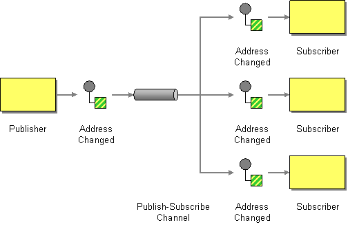
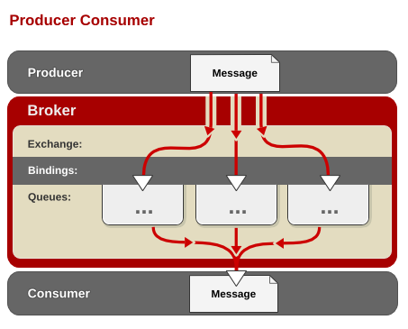
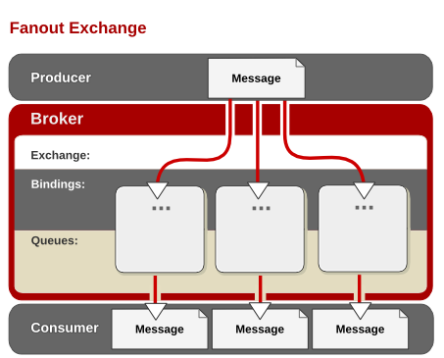
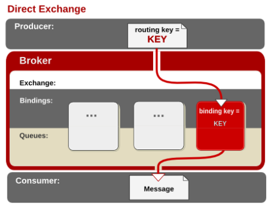
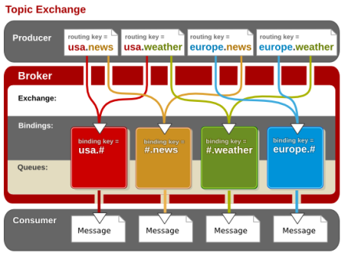
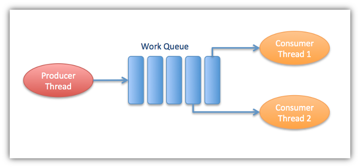
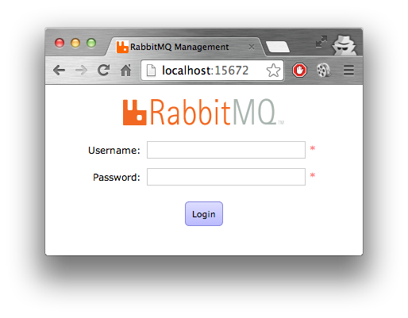
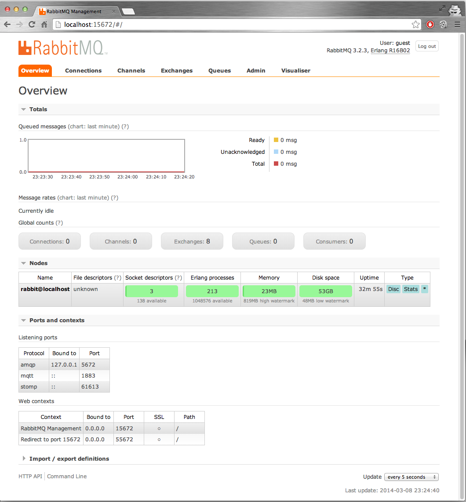
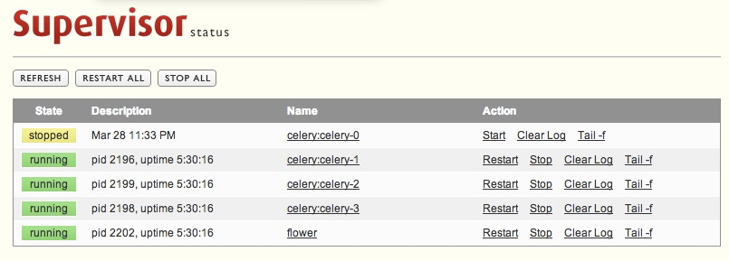

# Porque necesito usar mensajes?

--------------------------------------------------

# Implementar Galeria de Imagenes

--------------------------------------------------

# Recontra sencillo no es asi?

--------------------------------------------------

# LLegan los nuevos requerimientos

* podemos notificar a los amigos del usuario sobre sus nuevas imagenes.
* premios a los usuarios por cada foto que suben.
* Esta de moda Twitter, enviemos notificaciones.

--------------------------------------------------

# Problemas!!

* Estamos mostrando las imagenes sin redimencionar.
* Ya tenemos un proceso de redimencion en Java usemos eso (pero la aplicación esta en php :).
* Otro desarrollador dice: necesito llamar tus sistemas PHP pero desde Python.
* y tambien a Java y Ruby.

--------------------------------------------------

# Performance en la Aplicacion

**Usuario:**

* La aplicación se demora demasiado publicando una imagen.

--------------------------------------------------

# Se podria deber a esto:

* Redimención.
* Notificación.
* Premios.
* clases que contienen 6000 lineas de codigo.
* Programadores que piensan en escalabilidad Vertical.

--------------------------------------------------

# Lo que piensa el usuario

## a mi no me interesa, yo quiero publicar mi imagen!!!

--------------------------------------------------

# Nosotros.

--------------------------------------------------

# Performance en la Aplicacion

**Usuario:**

* La aplicación se demora demasiado publicando una imagen.

--------------------------------------------------

# Se podria deber a esto:

* Redimención.
* Notificación.
* Premios.
* clases que contienen 6000 lineas de codigo.
* Programadores que piensan en escalabilidad Vertical.

--------------------------------------------------

# Lo que piensa el usuario

### a mi no me interesa, yo quiero publicar mi imagen!!!

--------------------------------------------------

# Nosotros.

--------------------------------------------------

# Nuestro Codigo

## IndexController

    !php

    //Image Controller solo es un ejemplo
    $this->validateParameters($params);
    $this->isActiveProxy();
    $ruta = $this->serverElements . $this->config['rest']['image'];
    $request = \Requests::post($ruta, array(), $params, $this->options);
    // Resize image

    $this->notifyFriends();
    $this->awardUser();
    $this->tweetNewImage();

--------------------------------------------------

# Preguntas:

* ¿Nuestro codigo puede aceptar nuevos requerimientos?
* Que pasa si:
    * necesitamos incrementar la velocidad de la redimención.
    * las notificaciones de los usuarios se tienen que enviar por email.
    * debemos quitar el servicio de twitter para las nuevas imagenes.
    * en la redimención se tiene que usar Java o C

--------------------------------------------------

# Que Hacemos?

* Usamos Crones?
    * no son inteligentes.
    * no sirven para escalabilidad.
    * Como lo haces en PHP no puedes usar Java.

### Los cambios lo quieren para Ayer

### Que Hacemos!!!

--------------------------------------------------

# Usamos Mensajeria:

--------------------------------------------------

# Design:

## Publish / Suscribe Pattern

--------------------------------------------------

# Implementacion:

    !php

    <?php
        //Image Controller solo es un ejemplo
        $this->validateParameters($params);
        $this->isActiveProxy();
        $ruta = $this->serverElements . $this->config['rest']['image'];
        $request = \Requests::post($ruta, array(), $params, $this->options);
        // Resize image

        $this->notifyFriends();
        $this->awardUser();
        $this->tweetNewImage();

--------------------------------------------------

# Otras Implementaciones:

## No Hay Otras Implementaciones

--------------------------------------------------

# Que nos Permite Hacer la Mensajeria?

* Compartir Datos entre procesos.
* Procesos Pueden Ser Parte de diferentes Aplicaciones.
* las Aplicaciones Pueden Vivir en Diferentes Servidores.
* Redundancia.
* Disponibilidad.
* Desacoplamiento.
* Escalabilidad.
* Elasticidad.

--------------------------------------------------

# Conceptos:

* Los mensajes son enviados por **publicadores**
* Los mensajes se envian a **Consumidores**
* Los mensajes pasan a través de un **Chanel**

--------------------------------------------------

# RabbitMQ:

--------------------------------------------------

# Que es RabbitMQ?

* Sistema de Mensajeria Empresarial.
* Codigo Libre.
* Escrito en Erlang.
* Soporte Comercial.
* Mensajeria via AMQP.

--------------------------------------------------

# Instalacion:

## OS X

    !bash

    brew install rabbitmq

## Debian

    !bash

    $ sudo apt-get update
    ...
    $ sudo apt-get install rabbitmq-server

## Windows

    !bash

    Descarga y next next :p

--------------------------------------------------

# Caracteristicas

* confiable y altamente Escalable.
* Fácil de Instalar.
* Fácil de Clusterizar.
* Multiplataforma.
* AMQP 0.8 - 0.9.1

--------------------------------------------------

# Clientes AMQP

* Java
* .NET/C#
* Erlang
* Ruby
* Python
* PHP, PERL ...

--------------------------------------------------

# AMQP

* Adavanced Message Queuing Protocol.
* Pensado para la Interoperabilidad.
* Protocolo Completamente Abierto.
* Protocolo Binario.

--------------------------------------------------

# Flujo de Mensajes:

--------------------------------------------------

# Modelo AMQP

* Exchanges.
* Message Queues.
* Bindings.
* Rules For Binding Them.

--------------------------------------------------

# Tipo de Exchange

* Fanout
* Direct
* Topic

--------------------------------------------------

# Fanout Exchange:

--------------------------------------------------

# Direct Exchange:

--------------------------------------------------

# Topic Exchange:

--------------------------------------------------

# Que pasa si necesito mayor performance:

--------------------------------------------------

# Levanto mas consumidores:

--------------------------------------------------

# y que pasa con los mensajes?

--------------------------------------------------

# Administracion:

## Debian

    !bash

    $ rabbitmq-plugins enable rabbitmq_management
    $ sudo service rabbitmq-server start

## OS X

    !bash

    $ brew services start rabbitmq

**En OS X, el plugin de administración viene por defecto.**

--------------------------------------------------

# Prueba de administracion:

## Ejecutamos:

    !bash

    $ rabbitmqctl status

## Salida:

    !bash

    [{pid,10062},
      {running_applications,
          [{rabbitmq_management_visualiser,"RabbitMQ Visualiser","3.2.3"},
          {rabbitmq_management,"RabbitMQ Management Console","3.2.3"},
          {rabbitmq_web_dispatch,"RabbitMQ Web Dispatcher","3.2.3"},
          {webmachine,"webmachine","1.10.3-rmq3.2.3-gite9359c7"},
          {mochiweb,"MochiMedia Web Server","2.7.0-rmq3.2.3-git680dba8"},
          {rabbitmq_mqtt,"RabbitMQ MQTT Adapter","3.2.3"},
          {rabbitmq_stomp,"Embedded Rabbit Stomp Adapter","3.2.3"},
          {rabbitmq_management_agent,"RabbitMQ Management Agent","3.2.3"},
          {rabbitmq_amqp1_0,"AMQP 1.0 support for RabbitMQ","3.2.3"},
          {rabbit,"RabbitMQ","3.2.3"},

--------------------------------------------------

# Interfaz Gráfica:

* tecleamos en el navegador http://localhost:15672
* usuario por default **guest** password **guest**

--------------------------------------------------

# Login

--------------------------------------------------

# DashBoard

--------------------------------------------------

# Que pasa si el consumidor se cae?

--------------------------------------------------

# Usamos Supervisord:

--------------------------------------------------

# Supervisord:

--------------------------------------------------

# como saber si los procesos estan activos?

--------------------------------------------------

# Interfaz Grafica

--------------------------------------------------

# Demo:

## Yeah

--------------------------------------------------

# ¿Preguntas?